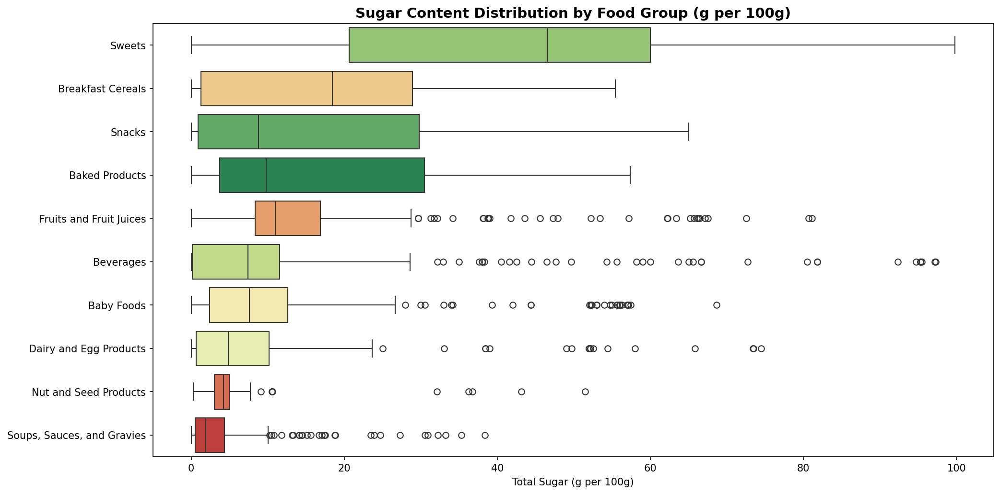
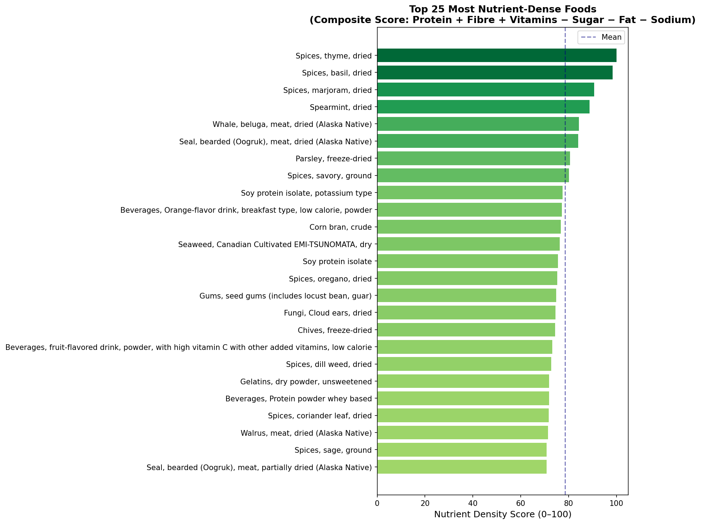
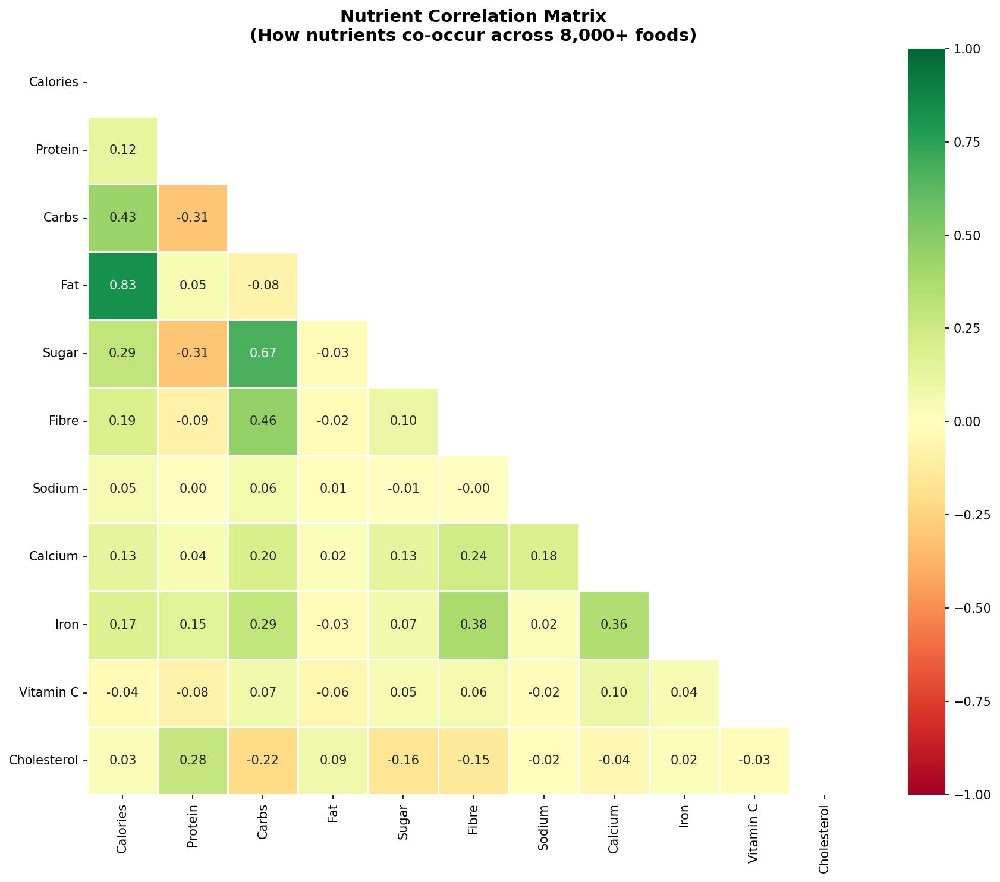

# Nutrition Database Analysis

**Tools I used:** Python · pandas · plotly · seaborn · scikit-learn
**Dataset:** USDA FoodData Central (April 2026 release), which was filtered to SR Legacy (Historic data on food components).
**7,793 well-tested reference foods, 11 core nutrients
**

## Why this project

As a self-proclaimed nutrition nerd, this project applies that domain knowledge to data analysis, producing insights directly relevant to product decisions in health tech (meal recommendation engines, food scoring, dietary coaching).

## Key Findings

### 1. Protein Efficiency by Food Group

Finfish and shellfish deliver **16.4g protein per 100 kcal** — which is the highest of any group, and nearly 3× the density of vegetables (5.75g/100kcal, still the 10th-ranked group). In a fat-loss phase when calorie budget is tight, these sources should be prioritised.

Poultry (13.4g), beef (12.8g), pork (12.6g), and lamb/veal (12.6g) form a tight second tier. Dairy and legumes trail at 6–7g. 

→ [Interactive scatter](outputs/a1_protein_scatter.html)


### 2. The Sugar Trap

Category averages mask enormous within-category variance. Breakfast cereals (17.5g/100g avg), snacks (16.4g), and baked products (16.4g) score close to fruit juices (16.2g), which are foods people don't mentally group with "sugary."

The real surprises are single items: **powdered beverage/drink mixes** (whiskey sour mix, lemonade powder, chocolate drink mix) hit 80–97g sugar per 100g, alongside dried fruit and whey powder - a distinct reminder that dry-weight USDA values can look extreme relative to as-consumed servings.




### 3. Nutrient Density Scoring

I built a composite score (protein + fibre + calcium + iron + vitamin C − sugar − fat − sodium, each min-max normalised) to rank all 7,793 foods.

The top 25 is dominated by **dried spices and herbs** (thyme scores 100/100, basil 98, marjoram 91) and dried Alaska Native meats (whale, seal, walrus) — a genuine artefact of per-100g scoring, since nobody eats 100g of dried thyme in one sitting.




### 4. Macro Distribution Across Food Groups

Macro ratios swing by **~55 percentage points** in protein share alone: finfish/shellfish sit at 68% protein / 4% carbs / 28% fat, while vegetables flip to 14% protein / 74% carbs / 12% fat.

Meat categories (beef, pork, lamb) cluster near 50% protein / 0% carbs / 48% fat — carbs are essentially absent from any animal-protein group.

→ [Interactive breakdown](outputs/a4_macro_distribution.html)


### 5. Nutrient Correlations

Fat and calories are tightly linked (r = 0.83, expected — fat is calorie-dense), and carbs/sugar move together (r = 0.67).

However, two textbook assumptions **don't hold** in this dataset: fat and cholesterol are only weakly correlated (r = 0.09, not the strong link often assumed), and sugar/fibre show a weak *positive* correlation (r = 0.10) rather than the expected trade-off — likely because SR Legacy skews toward whole, minimally-processed reference foods rather than branded/processed products where that trade-off is more pronounced.




## So What? (health tech implications)

1. Category-level labels are a poor proxy for actual nutrient content. The variance within a food group like beverages or fruits often exceeds variance between groups, so item-level scoring beats category-level guidance.
   
2. Protein *efficiency* (per calorie), not absolute protein grams, is the right metric for weight-management use cases.
   
3. Naive composite scoring breaks down without serving-size context — a "healthiest foods" ranking needs portion-aware normalisation, not raw per-100g values.

4. Assumed nutrient relationships (fat↔cholesterol, sugar↔fibre) don't automatically transfer across data sources. Any recommendation's rules should be validated against the specific food universe it will serve, not textbook heuristics.

   

## Repo Structure

```
nutrition-analysis/
├── README.md
├── requirements.txt
├── 01_setup_and_load.ipynb      # full pipeline: load → clean → 5 analyses
└── outputs/
    ├── a1_protein_scatter.html
    ├── a2_sugar_boxplot.png
    ├── a3_nutrient_density.png
    ├── a4_macro_distribution.html
    └── a5_nutrient_heatmap.png
```

## Setup

```bash
python3 -m venv .venv
source .venv/bin/activate
pip install -r requirements.txt
```

Download data from [fdc.nal.usda.gov/download-data](https://fdc.nal.usda.gov/download-data) (Full Download CSV). Update `DATA_PATH` in the first cell of `01_setup_and_load.ipynb`, then run all cells in order.

**Note:** the USDA schema maps sugar to nutrient ID `2000` ("Total Sugars") for SR Legacy foods in the April 2026 release, not the commonly-referenced ID `1063` ("Sugars, Total") — the latter has zero coverage for this food subset. The notebook's `KEY_NUTRIENTS` dict is already set correctly.

## Skills Demonstrated

| Skill | Where |
|---|---|
| pandas merge + pivot_table | Loading and reshaping the multi-table USDA schema |
| Data cleaning + null handling | Filtering invalid nutrient values, resolving a nutrient-ID mismatch |
| Feature engineering | `protein_per_100kcal`, macro %, composite nutrient density score |
| MinMaxScaler (scikit-learn) | Normalising nutrients for composite scoring |
| plotly interactive charts | Protein scatter, macro stacked bar |
| seaborn statistical plots | Box plot, annotated correlation heatmap |
